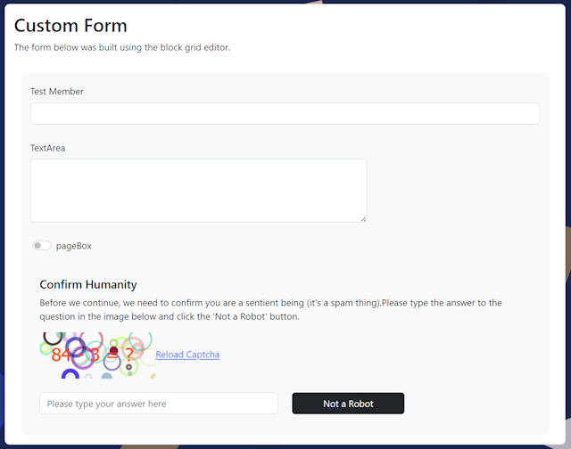
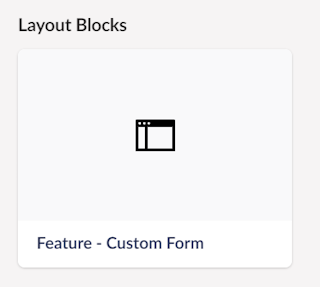
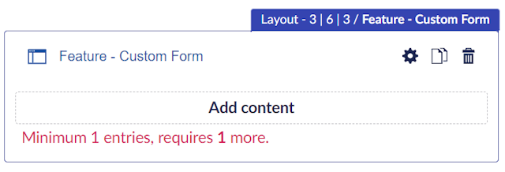
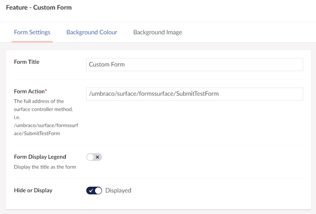
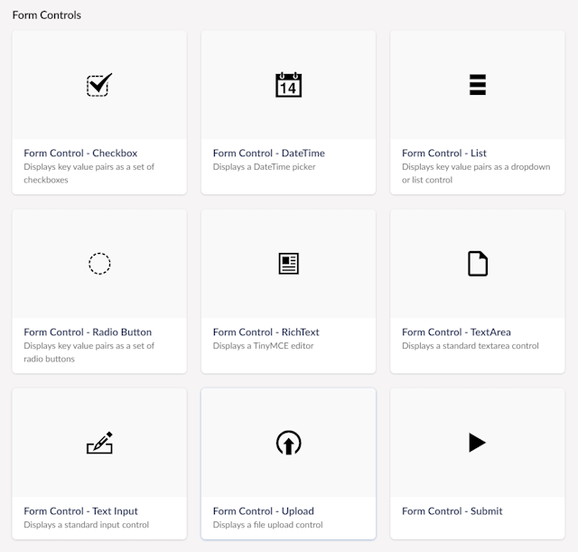
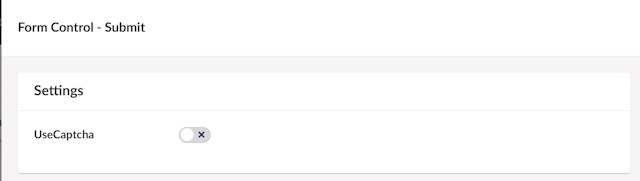
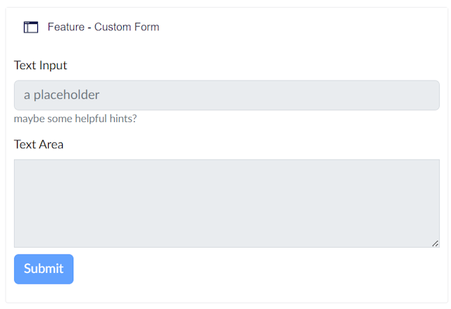

# Our.Cummunity.CustomForm
To use this package you need to be using the UmBootstrap template for Umbraco.

The package installs some document types to enable the creation of custom forms for UmBootstrap using the BlockGrid.



## After Installing the package
After the package has installed, there are a few steps you need to perfom to get everything working.

1. You will need to create a SurfaceController to accept and process your custom form when it is submitted, (example below).

``` public class TestSurfaceController : SurfaceController
    {
        private readonly Umbraco.Cms.Core.Hosting.IHostingEnvironment _hostingEnvironment;
        public TestSurfaceController(IUmbracoContextAccessor umbracoContextAccessor, IUmbracoDatabaseFactory databaseFactory, ServiceContext services, AppCaches appCaches, IProfilingLogger profilingLogger, IPublishedUrlProvider publishedUrlProvider,
            Umbraco.Cms.Core.Hosting.IHostingEnvironment hostingEnvironment) : base(umbracoContextAccessor, databaseFactory, services, appCaches, profilingLogger, publishedUrlProvider)
        {
            _hostingEnvironment = hostingEnvironment;
        }

        [AllowAnonymous]
        [ValidateAntiForgeryToken]
        [HttpPost]
        public IActionResult SubmitTestForm([FromForm] IFormCollection formModel)
        {
            if (formModel.Files.Any())
            {
                //handle the file upload
                foreach (var file in formModel.Files)  
                {  
                    if (file.Length > 0)  
                    {  
                        var infile = Path.Combine(_hostingEnvironment.ApplicationPhysicalPath, @"wwwroot", formModel["FormControlUploadPath"], file.FileName);  
  
                        using (var stream = System.IO.File.Create(infile))  
                        {  
                            file.CopyToAsync(stream);  
                        }  
                    }  
                }  
            }
            return View("TestResult",formModel);
        }
    }
```

2. Add the line below to your _ViewImports.cshtml

    ```@addTagHelper *, Our.Umbraco.TagHelpers```

## Creating a Form

The first step in adding a form to your blockgrid is to add the layout block





Once this has been added, click the settings icon to setup the form. The Form Action should be the path to your SurfaceController action.



You can now start to add form controls to the template



After adding each control, open the settings to ensure you have filled in any required properties, each control comes with it's own set of properties which control how it is rendered and what attributes are set, see [ADD LINK HERE!]

For the final step you should add the "Form Control - Submit", this adds the submit button and allows you to enable/disable a Captcha control.



